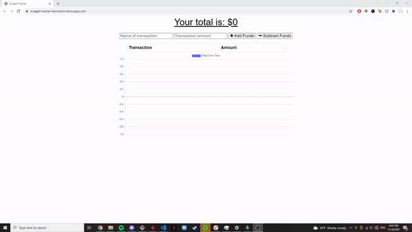

# Online/Offline Budget Tracker

## Table of Contents

- [Online/Offline Budget Tracker](#onlineoffline-budget-tracker)
  - [Table of Contents](#table-of-contents)
  - [Description](#description)
  - [Usage](#usage)
  - [Built With](#built-with)
  - [Technologies Used](#technologies-used)
  - [Contributing](#contributing)
  - [License](#license)
  - [Questions](#questions)
  - [User Story](#user-story)
  - [Business Context](#business-context)
  - [Acceptance Criteria](#acceptance-criteria)
  - [Commit Early and Often](#commit-early-and-often)
  - [Submission on BCS](#submission-on-bcs)
  - [Hint](#hint)
  

## Description
A progressive web application for tracking deposits and expenses. Giving users a fast and easy way to track their money is important, but allowing them to access that information anytime is even more important. Having offline functionality is paramount to our applications success. The user will be able to add expenses and deposits to their budget with or without a connection. When entering transactions offline, they should populate the total when brought back online. I used this app to explore indexDb as well as webpacks and progressive web application features

  

## Usage

[View Deployment](https://budget-tracker-henrykam.herokuapp.com/)

 

## Built With
* [Babel](https://babeljs.io/)
* [CSS](https://developer.mozilla.org/en-US/docs/Web/CSS)
* [Express.js](https://expressjs.com/)
* [HTML](https://developer.mozilla.org/en-US/docs/Web/HTML)
* [JavaScript](https://developer.mozilla.org/en-US/docs/Web/JavaScript)
* [MongoDB](https://www.mongodb.com/)
* [Mongoose](https://www.npmjs.com/package/mongoose)
* [Morgan](https://www.npmjs.com/package/morgan)
* [Node.js](https://nodejs.org/en/)
* [Nodemon](https://www.npmjs.com/package/nodemon)
* [Webpack](https://webpack.js.org/)

## Technologies Used

* [Microsoft Visual Studio Code](https://code.visualstudio.com/)
* [Git Bash](https://git-scm.com/downloads)
* [GitHub](https://github.com/)
* [Insomnia](https://insomnia.rest/)
* [Heroku](https://www.heroku.com/)
* [Robo 3T](https://robomongo.org/)
* [Lighthouse](https://developers.google.com/web/tools/lighthouse/)
* [Google Chrome Developer Tools](https://developer.chrome.com/docs/devtools/)

## Contributing

**Henry Kam**

- [Github](https://github.com/gulpinhenry)
- [LinkedIn](https://www.linkedin.com/in/kamhenry/)

## License

This application is covered under the MIT license

## Questions

For any questions, please reach out by creating an issue.
